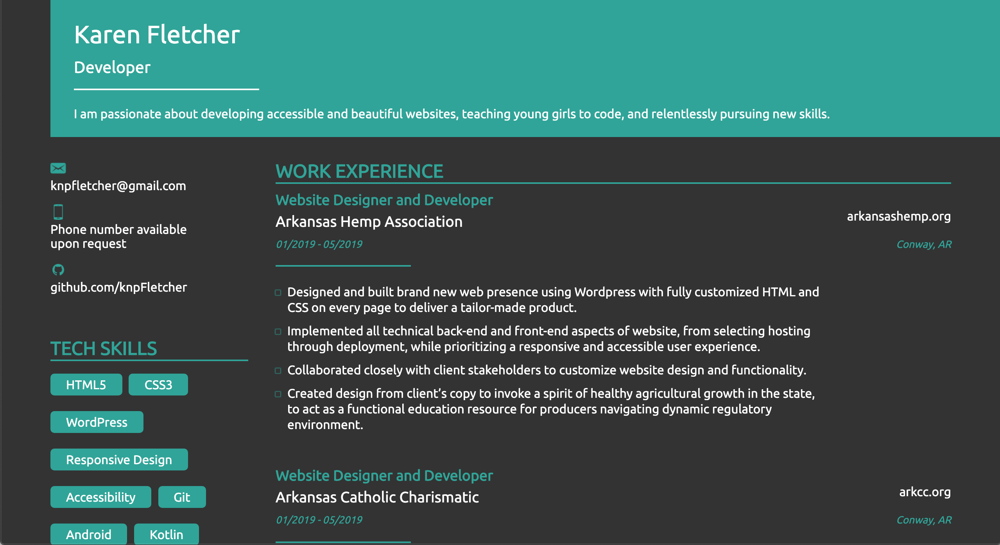
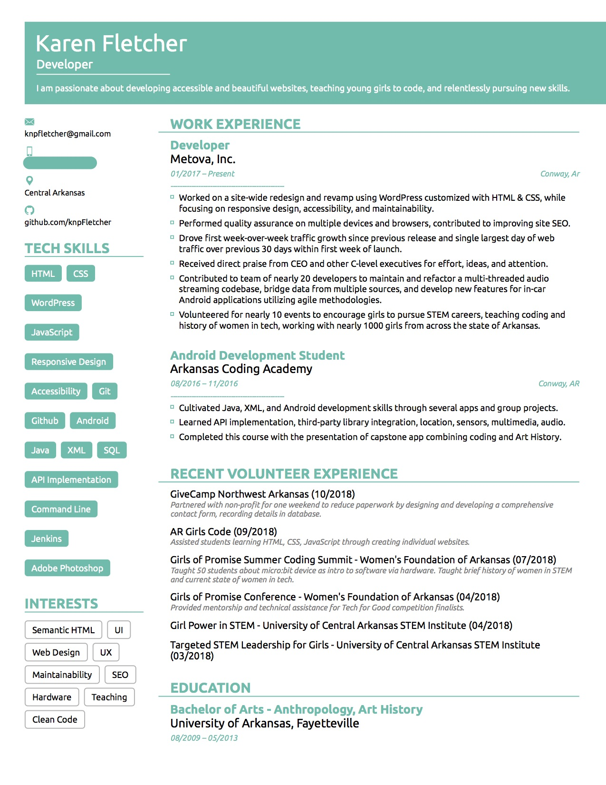

# R&eacute;sum&eacute;

A website recreation of my r&eacute;sum&eacute; document using ReactJS, featuring a responsive, mobile first, accessible design.

Now with Dark Mode on available browsers!

## Technologies Utilized

* ReactJS
* HTML
* CSS
  * FlexBox for ease of implementation for layout scaling and element alignments

Please use `yarn install` and `yarn start` commands to execute this project locally.

## Key Differences

* Mobile responsive design
* Accent color adjusted for better contrast
* Interactive links to relevant contact info

